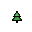

# CSM-Icon-Editor-Glyphs

Resources of LabVIEW Icon Editor for CSM.

## CSM API Template

.png)

.png)

## CSM Glyphs

.png)

.png)
.png)
.png)
.png)

.png)

.png)

.png)

.png)

.png)

.png)

.png)
.png)

.png)

.png)

.png)

.png)

.png)

.png)

